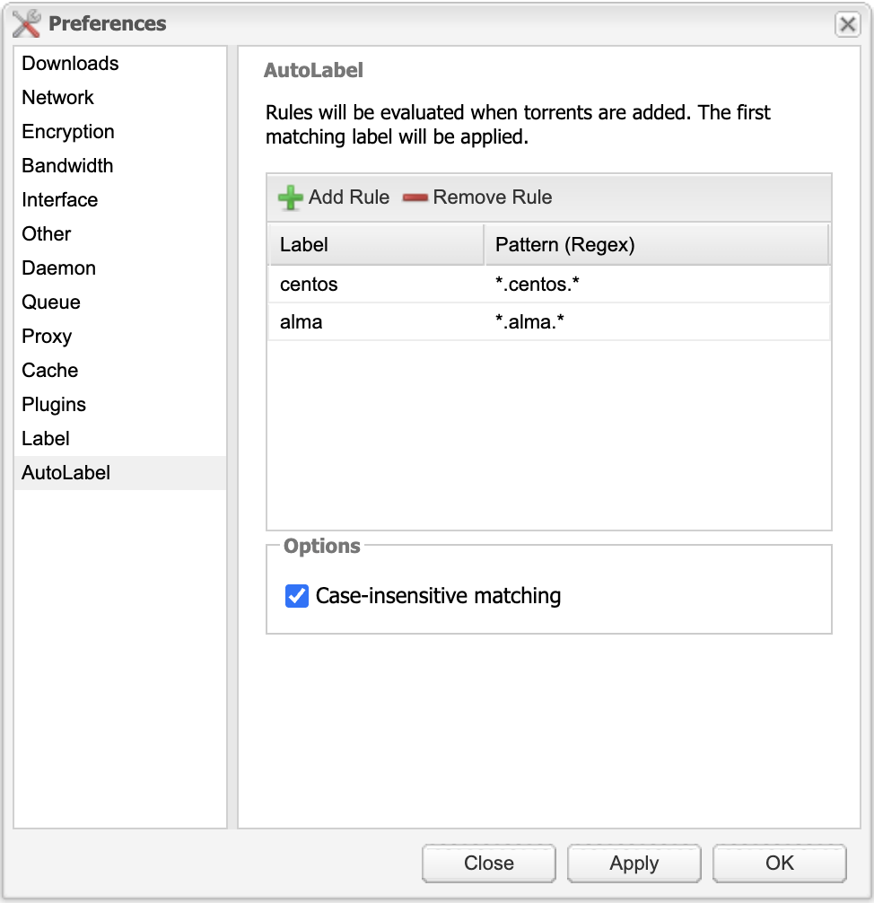

# AutoLabel - Deluge Plugin

AutoLabel is a plugin for [Deluge](https://deluge-torrent.org/) that automatically applies labels to torrents when they are added, based on customizable regex patterns. It integrates with Deluge's built-in Label plugin.

## Features

- 🏷️ **Automatic Labeling**: Automatically apply labels to torrents when they're added
- 🔍 **Regex Pattern Matching**: Use regular expressions to match torrent names
- ⚙️ **Flexible Configuration**: Configure multiple rules with different patterns and labels

## Screenshot



## Requirements

- Deluge 2.x
- Label plugin enabled in Deluge

## Installation

Copy the egg file from Github releases to your Deluge plugins directory:

```bash
# Linux/macOS
cp AutoLabel-*.egg ~/.config/deluge/plugins/

# Windows
copy AutoLabel-*.egg %APPDATA%\deluge\plugins\
```

You can download a pre-built release from this Github page or [Build from Source](#building-from-source)

- Restart Deluge
- Enable the Label plugin (if not already enabled):
  - In **Preferences** → **Plugins**, make sure **Label** is checked
- Enable the **AutoLabel** plugin in **Preferences** → **Plugins**

## Build from Source

### Prerequisites

- Python 3.6 or higher
- setuptools

### Build Steps

1. **Clone the repository**:

   ```bash
   git clone https://github.com/vaunus/deluge-plugin-autolabel.git
   cd deluge-plugin-autolabel
   ```

2. **Build the egg file**:

   ```bash
   python setup.py bdist_egg
   ```

3. **The egg file will be created in the `dist/` directory**:
   ```bash
   ls dist/
   # Output: AutoLabel-1.0-py3.X.egg
   ```

### Building for Multiple Python Versions

Use the included build script to build eggs for all available Python versions:

```bash
python build.py
```

This will create egg files for each Python version found on your system.

## Usage

### Configuring Rules

1. Open Deluge and go to **Preferences** → **AutoLabel**

2. **Add a new rule**:

   - Click **Add Rule**
   - Enter a **Label** name (e.g., "ISOs")
   - Enter a **Regex Pattern** (e.g., `.*linux.iso.*`)
   - The rule will be enabled by default

3. **Configure options**:

   - **Case-insensitive matching**: Enable to ignore case when matching patterns

4. Click **Apply** or **OK** to save your settings

### Applying Rules

- Rules are automatically applied when torrents are added
- The first matching rule's label will be applied
- Labels that do not exist will be created
- From here the configuration of the Label or other plugins based off the label can be used to further customise the behavior

## Configuration

The plugin stores its configuration in `autolabel.conf` in your Deluge config directory.

### Contributing

Contributions are welcome! Please feel free to submit a Pull Request.

## Support

If you find this plugin useful, please consider buying me a coffee:

<a href="https://buymeacoffee.com/vaunus" target="_blank"></a>

## License

This project is licensed under the GNU General Public License v3.0 or later - see the [LICENSE](LICENSE) file for details.
